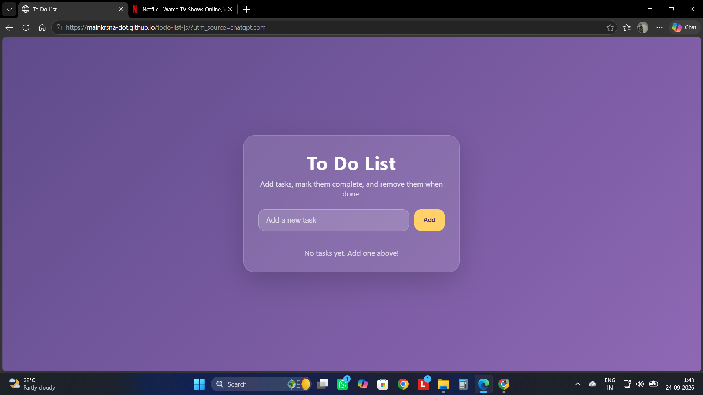
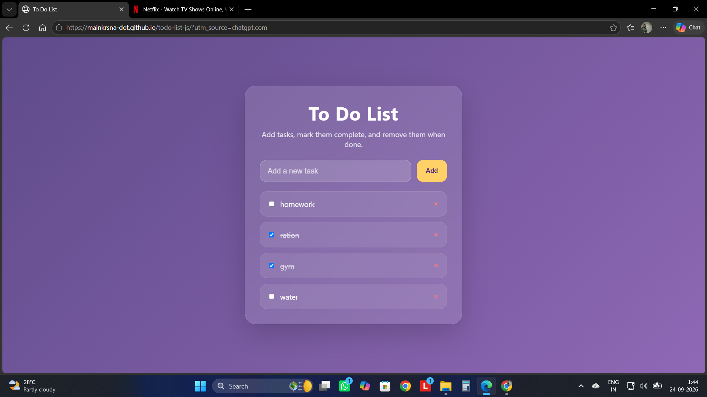

# To-Do List Web App

A responsive To-Do List web application built using HTML5, CSS3 and JavaScript.

## Features

- Add new tasks
- Mark tasks as completed
- Delete tasks
- Persistent task storage using localStorage
- Responsive user interface
- Tasks remain saved after page reload

## Technologies Used

- HTML5
- CSS3
- JavaScript
- localStorage

## Project Structure

todo-list-js/
├── screenshots/
│   ├── todo-main.png
│   └── todo-functionality.png
├── index.html
├── script.js
└── style.css

## Live Demo

[View Live Demo](https://mainkrsna-dot.github.io/todo-list-js/)

## Screenshots

### Main Interface

### Task Management

## How to Run

Open `index.html` in your web browser to run the application.

## Disclaimer

This project is created for educational and portfolio purposes.
